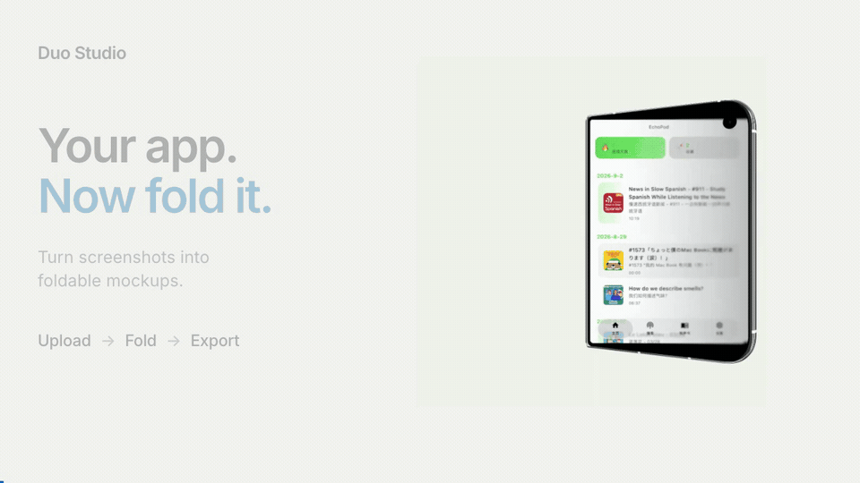

# Duo Studio

[English](README.md) · [简体中文](README.zh-CN.md) · **[Try it online ↗](https://iduo.clothpath.com/)**

Turn app screenshots and websites into foldable device mockups. Preview different poses and export images or animations, all in your browser.

[](docs/media/duo-studio-overview.mp4)

[Watch the 8-second demo](docs/media/duo-studio-overview.mp4)

## How to use

1. **Add content** — upload inner and outer screen screenshots, or switch to Browser mode and enter a website URL.
2. **Choose a pose** — closed, unfolded landscape or portrait, seated, standing, or free fold. Adjust the fold and background.
3. **Export** — save PNG mockups or MP4, WebM and GIF animations. Save a `.duo.json` project to continue later.

Screenshots are processed locally. Browser mode requires a site that allows embedding; exporting it requires permission to capture the current tab. Video formats depend on browser support.

## Run locally

Node.js 22+.

```sh
npm ci
npm run dev
```

Open [localhost:5173](http://localhost:5173). Run `npm run build` to create `dist/`.

For **Cloudflare Pages**, use build command `npm run build` and output directory `dist`. No backend or API keys required.

## Credits & license

Inspired by [iphone-duo](https://github.com/chuspeeism/iphone-duo) and [DuoLikeAnimation](https://github.com/elijah-semyonov/DuoLikeAnimation). Built with Codex Astra.

Code: [MIT](LICENSE). Device assets originate from Apple and belong to their respective owners; see [asset provenance](docs/APPLE_VIEWER.md). Mockups demonstrate appearance and do not verify actual app compatibility.
