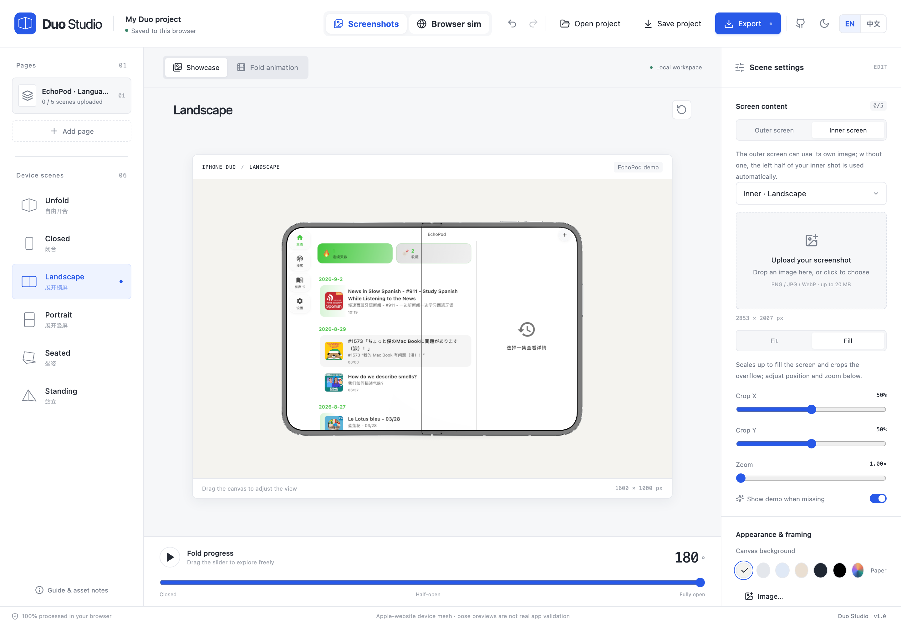
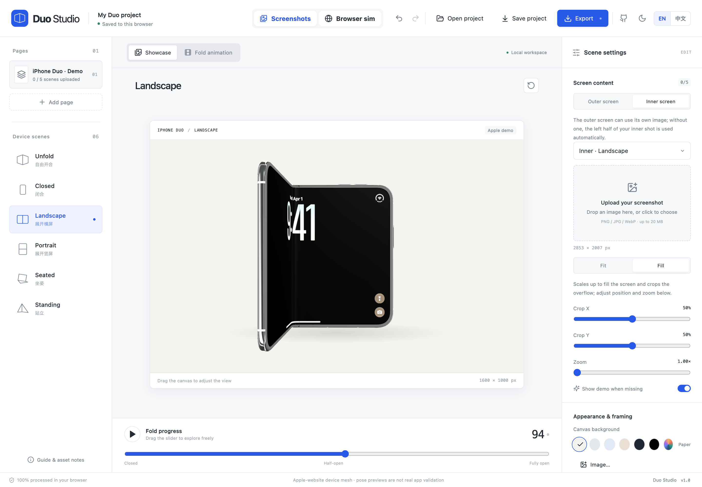
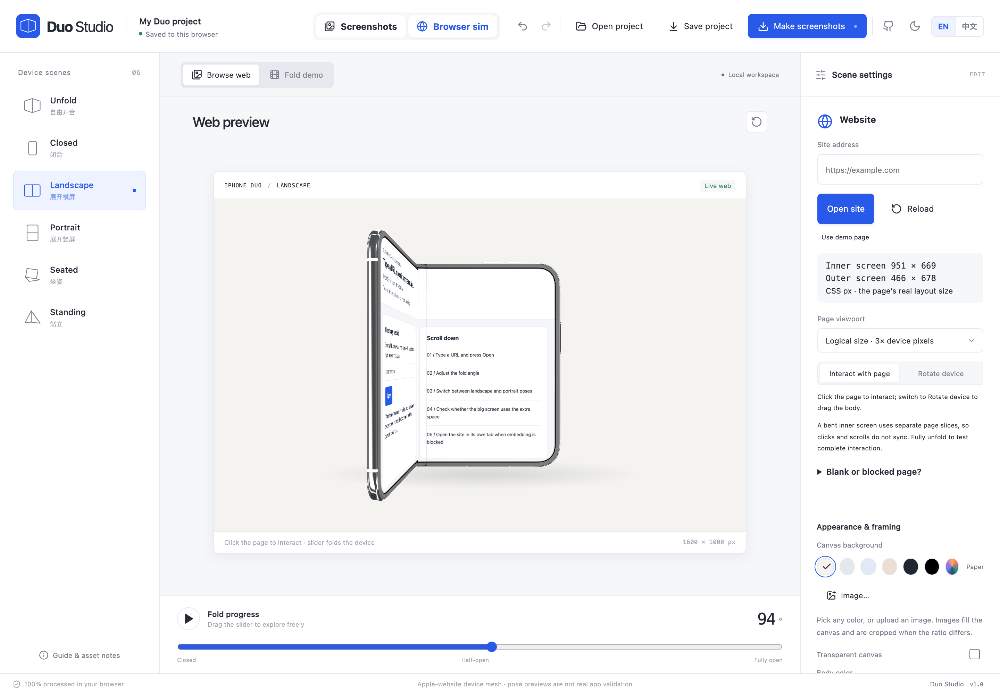
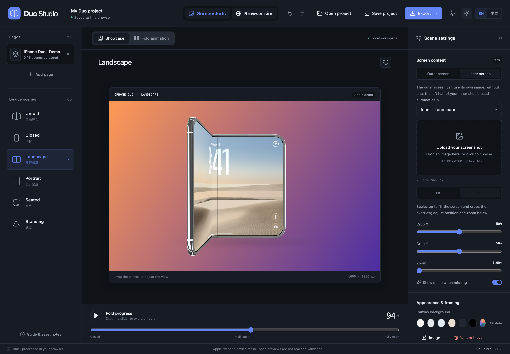

# iPhoneDuoMock

**[English](README.md)** · [简体中文](README.zh-CN.md)

**Live demo: <https://iduo.clothpath.com/>**

A foldable-phone screenshot studio that runs entirely in your browser. Place your app screenshots on the Apple-website 3D device model, pose it, and export PNGs, MP4/WebM/GIF open-close animations, or a full App Store scene bundle. Images are never uploaded — everything is processed locally, and a static host (e.g. Cloudflare Pages) only serves files.



| Free folding | Live browser simulation | Dark mode & custom backgrounds |
| :---: | :---: | :---: |
|  |  |  |

## Features

- **Six device poses** — closed, landscape, portrait, seated, standing, and free fold with a live slider.
- **Screenshot workbench** — upload outer/inner shots per page, fit or crop them, and manage up to 20 pages per project.
- **Browser simulation** — load any embeddable website, watch it reflow across the inner and outer screens, and export it through an authorised current-tab capture that stays local.
- **Local-first export** — PNG stills, frame-by-frame MP4/WebM (30 fps), GIF loops (12 fps), a per-page PNG ZIP bundle, and strictly-sized raw UI PNGs.
- **Portable projects** — save a `.duo.json` file carrying every screenshot; autosave keeps working in the browser via IndexedDB.
- **English & Chinese UI, dark mode** — switch languages and themes from the top bar.

## Getting started

Requires Node 22+.

```sh
npm ci
npm run dev        # http://127.0.0.1:5173/
```

Other commands:

```sh
npm run build          # production build → dist/
npm run preview
npm test               # unit tests (Vitest)
npx playwright install chromium
npm run test:e2e       # end-to-end tests
npm run test:production
```

## Deploy (Cloudflare Pages)

No server, Functions, API keys, or environment variables needed.

| Setting | Value |
| --- | --- |
| Framework preset | Vite |
| Build command | `npm run build` |
| Build output directory | `dist` |
| Node | 22 (`.node-version`) |

`public/_headers` and `_redirects` ship with the build and configure CSP and static caching. A top-level `404.html` returns real not-found responses; the editor uses only `/` (there are no client-side path routes).

## Search and sharing

`npm run build` generates canonical/social metadata, English and Chinese static guides, robots.txt and sitemap.xml through `scripts/generate-seo.mjs`. The public origin is `https://iduo.clothpath.com`; update it in that script if moving domains. The guide pages need no JavaScript. `npm run test:seo` verifies built metadata and crawlable content. See [docs/SEO-GEO.md](docs/SEO-GEO.md) for validation and post-deployment checks.

## Limitations

- Single images up to 20 MiB / 4096 px / 16 MP; projects up to 20 pages and 75 MiB of embedded assets.
- Video export uses WebCodecs; MP4/AVC and WebM/VP9 availability depends on the browser (clearly reported when unsupported).
- The device mesh and fold animation come from the Apple website; previews are marketing visuals, not a substitute for real app adaptation or App Store App Previews.

More details in [docs/PRD.md](docs/PRD.md), [docs/IMPLEMENTATION_PLAN.md](docs/IMPLEMENTATION_PLAN.md), and [docs/VALIDATION.md](docs/VALIDATION.md).

## Acknowledgements

- [iphone-duo](https://github.com/chuspeeism/iphone-duo) — inspiration for the foldable device mockup direction.
- [DuoLikeAnimation](https://github.com/elijah-semyonov/DuoLikeAnimation) — inspiration for the open/close animation approach.
- Codex Astra — this project was built with the help of the Codex Astra coding agent.

Default placeholder screens reproduce the lock screen from Apple's iPhone Duo product gallery ([apple.com/sg/iphone-duo](https://www.apple.com/sg/iphone-duo)), used only to demonstrate the tool.

## License

Released under the [MIT License](LICENSE). Device geometry, textures, and animations originate from the Apple website and belong to their original owners; see [docs/APPLE_VIEWER.md](docs/APPLE_VIEWER.md) for provenance and reproduction scope.
